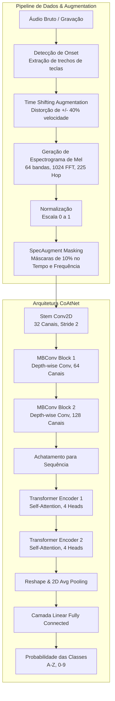

# teclahacker ⌨️🎧

Uma implementação prática de um ataque de canal lateral acústico em teclados (Acoustic Side-Channel Attack) utilizando Deep Learning. 

Demonstra como o som das teclas pode ser usado para inferir o que está sendo digitado utilizando Redes Neurais Convolucionais (CNNs) e Espectrogramas de Mel.

> *ponto é, implementar em seus próprios termos.... hackee as emanações do teclador*

⚠️ **Aviso:** Este projeto tem fins estritamente **educacionais e de pesquisa**. Não utilize para fins maliciosos ou para interceptar dados sem autorização.

## Requisitos

- Python >= 3.11, < 3.13
- [Poetry](https://python-poetry.org/) para gerenciamento de dependências.

## Instalação

Na raiz do projeto, instale as dependências executando:

```bash
poetry install
```

Isso instalará as bibliotecas necessárias, incluindo `torch`, `torchaudio`, `librosa`, `numpy` e `scipy`.

## Experimento Rápido (Dados Falsos)

Para testar o fluxo de ponta a ponta sem precisar gravar horas de áudio do seu próprio teclado, incluímos um gerador de dados sintéticos.

**1. Gerar o conjunto de dados de teste e o áudio alvo:**
```bash
poetry run python gerar_exemplo_zorro.py
```
Isso criará uma pasta `dados_falsos/` com áudios curtos simulando as teclas necessárias e um arquivo `o_zorro_e_gris.wav` simulando alguém digitando a frase "o zorro e gris".

**2. Treinar a Rede Neural:**
```bash
poetry run python teclahacker.py --treinar dados_falsos/
```
O script processará os áudios, extrairá os Espectrogramas de Mel e treinará a CNN. No final, salvará o modelo (`modelo_teclado.pth`) e as classes reconhecidas (`classes.txt`).

**3. Testar a "escuta" (Predição):**
```bash
poetry run python teclahacker.py --prever o_zorro_e_gris.wav
```
O modelo tentará decodificar o áudio simulado e deverá imprimir algo muito próximo de `o zorro e gris`.

## Usando com um Teclado Real

Para usar com o seu próprio teclado, siga esta estrutura:

1. **Gravação e Organização:** Utilize o nosso gerador automático `quickstart.py` para gravar as teclas do seu teclado. Ele pedirá as teclas desejadas, gravará o áudio em tempo real e as organizará na pasta `dados_treino/`.
   ```bash
   poetry run python quickstart.py
   ```
2. **Treinamento:** Finalize o treinamento na pasta com os áudios reais gravados:
   ```bash
   poetry run python teclahacker.py --treinar dados_treino/
   ```

### Testando o Modelo Real ("o zorro e gris")

Após treinar o modelo, você pode testá-lo digitando uma frase real.

**1. Grave você mesmo digitando "o zorro e gris":**
Execute este script de teste. Ele lhe dará uma contagem regressiva de 3 segundos e gravará 8 segundos do seu microfone enquanto você digita fisicamente a frase "o zorro e gris" no seu teclado.
```bash
poetry run python record_test.py
```
*(Isso salvará sua sessão de digitação como `meu_teste_zorro.wav`)*

**2. Execute o ataque (Previsão):**
Agora, passe essa gravação real para o seu modelo totalmente treinado para ver se ele consegue decodificar o que você digitou:
```bash
poetry run python teclahacker.py --prever meu_teste_zorro.wav
```

## Arquitetura & Pipeline de Dados

O fluxo de dados reproduz com precisão o que foi proposto por Harrison et al. (2023), utilizando uma variante da arquitetura **CoAtNet** associada a fortes técnicas de Data Augmentation (*SpecAugment* e *Time Warping*). 

Abaixo está o diagrama do pipeline completo de ponta a ponta:



## Como funciona?

1. **Extração de Início (Onset):** A biblioteca `librosa` é usada para detectar os picos de energia no áudio (o exato momento do clique da tecla).
2. **Espectrogramas de Mel:** O trecho de áudio de cada clique é convertido em uma representação visual (espectrograma de Mel), que captura as frequências ao longo do tempo.
3. **CNN:** Uma Rede Neural Convolucional (implementada em PyTorch) recebe essa imagem do som e classifica de qual tecla ela pertence.

## Referências

```bibtex
@misc{henry2026quantummnist,
  author = {Julian Henry},
  title = {quantum-mnist},
  year = {2026},
  organization = {Aeae.inc},
  address = {Houston, Texas},
  note = {Software repository}
}

@misc{harrison2023practical,
  title={A Practical Deep Learning-Based Acoustic Side Channel Attack on Keyboards}, 
  author={Joshua Harrison and Ehsan Toreini and Maryam Mehrnezhad},
  year={2023},
  eprint={2308.01074},
  archivePrefix={arXiv},
  primaryClass={cs.CR}
}

@inproceedings{zhuang2005keyboard,
  title={Keyboard acoustic emanations revisited},
  author={Zhuang, Li and Zhou, Feng and Tygar, J. D.},
  booktitle={Proceedings of the 12th ACM conference on Computer and communications security},
  pages={373--382},
  year={2005}
}
```
